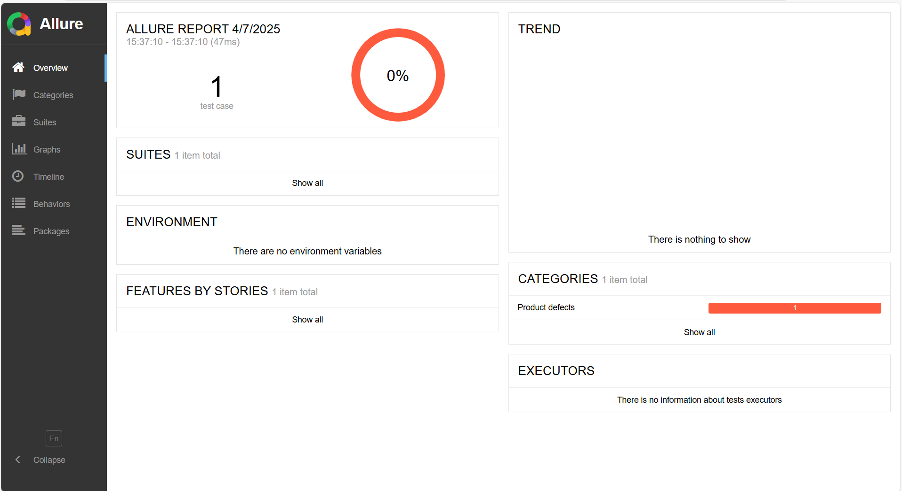
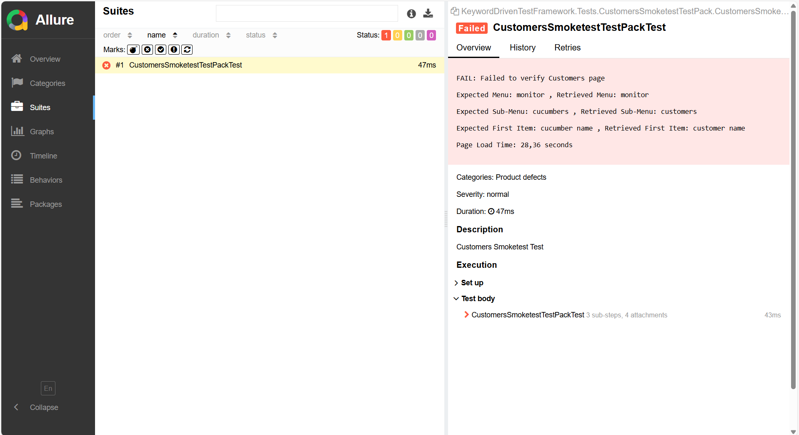
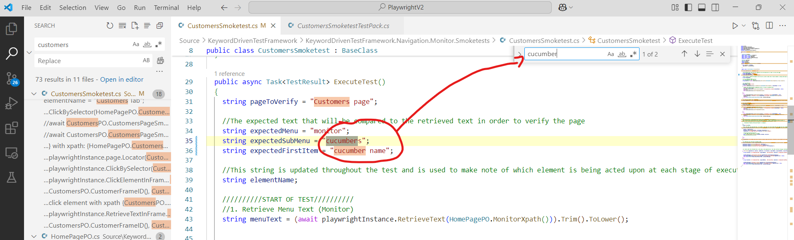
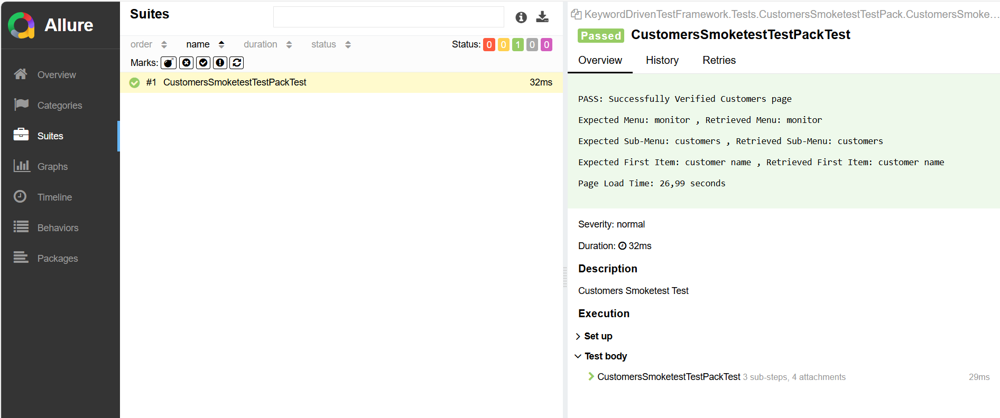
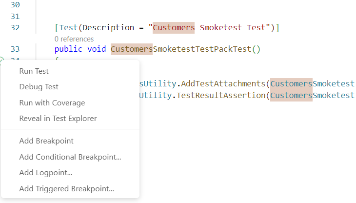
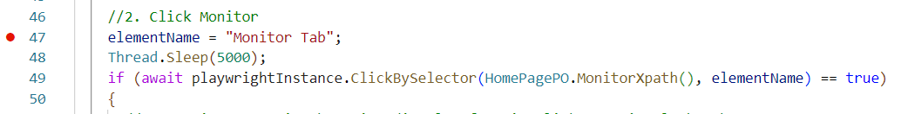
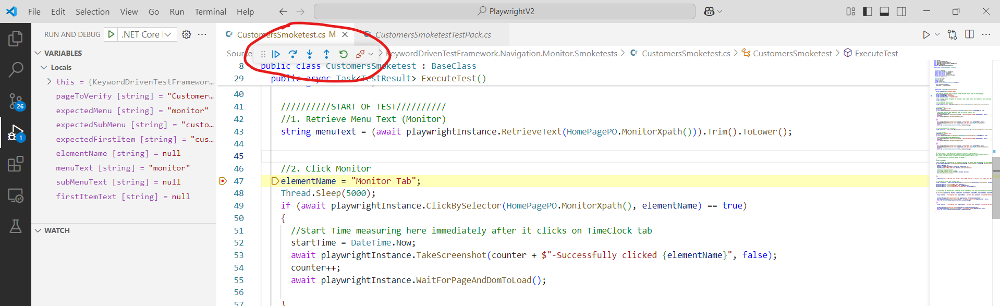

# Debugging Your C# Playwright Tests in VS Code: A Practical Guide

**Author**: Rofhiwa "Ralph" Matumba

Welcome! If you're working with C# and Playwright for automated testing in Visual Studio Code, knowing how to debug effectively is a superpower. This guide will walk you through identifying and fixing issues in your tests, from simple typos to more complex problems.

## What You'll Need

* **Visual Studio Code (VS Code):** Your code editor.
* **Working Playwright Setup:** You should have Playwright installed for C#, and your tests should generally be runnable. Basic familiarity with running your tests is helpful.

## Example Scenario: Investigating a Failed Test (Like an Incorrect Locator)

Imagine a test fails when run automatically (perhaps in a CI system like Jenkins). Your first step is usually to see if you can reproduce the failure on your own machine, where you have more tools to investigate.

1. **Run the Test Locally:** Find the test file (`.cs`) containing the failed test and run it directly from VS Code.
2. **Check the Report:** After the test run finishes, view the results. Many teams use reporting tools like Allure or ExtentReports.
    * *Using specific batch files (in some setups):* You might run batch files like `Generate Allure Report.bat` and then `Open Allure Report.bat`.
    * *The Goal:* Open a detailed report that shows which tests passed or failed.

3. **Analyze the Failure in the Report:** Inside the report (Allure, ExtentReports, console output, etc.), find the failed test. Reporting tools provide a good overview.

    * *Example using Allure:* Click on a 'Suites' tab or find the specific test suite that contains the failure.
         *(This image shows an example Allure report overview)*

4. **Drill Down into the Error Details:** Click on the specific failed test case. The report provides details about *why* it failed. Look for:
    * **Error Message:** A specific message indicating the problem (e.g., "Element not found," "Timeout," "Assertion failed").
    * **Stack Trace:** A sequence of function calls leading up to the error, helping pinpoint where in the code the failure occurred.
    * **Screenshots/Videos:** Playwright can often capture these automatically on failure, showing the state of the application when things went wrong.
    * **Comparison Details (for assertion failures):** If the test failed because something wasn't as expected, the report often shows the difference.

    *Example Failure Detail (Illustrative):*
     *(This image shows example details for a failed test in Allure)*

    In this specific example, the `CustomersSmokeTest` failed with a custom message indicating a mismatch:

```txt
    FAIL: Failed to verify Customers page 

    Expected Menu: monitor , Retrieved Menu: monitor 
    Expected Sub-Menu: cucumbers , Retrieved Sub-Menu: customers 
    Expected First Item: cucumber name , Retrieved First Item: customer name

    Page Load Time: 28,36 seconds
```

The report clearly shows the test expected the text `cucumbers` but actually found `customers`. This points to a likely typo in the test code or an incorrect requirement.

5. **Locate the Issue in Your Code:** Based on the error message (like the text `cucumbers`), search your codebase.
    * Use VS Code's search (**Ctrl+F**). Searching for a unique part of the incorrect text (e.g., `cucumber`) is effective.
     *(VS Code's search bar appears near the top)*

    * The search results lead you to the line(s) in your test code responsible for the error.
     *(The search highlights occurrences of "cucumber" in the code)*

6. **Fix and Rerun:** In this simple case, correcting the typo (changing `cucumbers` to `customers` in the test code's expectation or locator) and rerunning the test solves the issue.

## Debugging When Errors Aren't Obvious (Using Breakpoints!)

Sometimes, the error message isn't clear, or the test fails for reasons that aren't immediately obvious from the report (like complex logic errors). This is where VS Code's debugger becomes essential.

### Running Tests in Debug Mode

VS Code integrates nicely with the .NET testing framework.

1. **Find the Test Method:** Locate the `[TestMethod]` (or similar attribute like `[Fact]` or `[Test]`) in your C# test file.
2. **Don't Just Run, Debug:** You'll see a small "play" icon or text like "Run Test" next to the method definition. Instead of just clicking it, **right-click** the icon or text.
3. **Select "Debug Test":** Choose the "Debug Test" option from the context menu. (Depending on your VS Code extensions and setup, you might see a dedicated "debug" icon directly).
     *(Shows the menu with 'Debug Test' option)*

Running in debug mode alone won't change much *until* you add breakpoints.

### Using Breakpoints

A breakpoint tells the debugger: "Pause execution right here!"

1. **Set a Breakpoint:** Click in the margin just to the left of the line number where you want execution to pause. A red dot will appear. Choose a line *before* the suspected problematic code executes.
     *(Red dot indicates a breakpoint set on a line number)*

2. **Start Debugging:** Run the test in Debug mode as described above.
3. **Execution Pauses:** When the debugger reaches the line with the breakpoint, execution will stop. The line will often be highlighted (e.g., in yellow), and a floating toolbar with debugging controls will appear.
     *(Shows the yellow highlight on the paused line and the debug controls)*

### Understanding the Debugging Controls

This toolbar lets you control the execution flow precisely:

* **Continue (F5):** Resumes running the code normally until it hits another breakpoint or the test finishes.
* **Step Over (F10):** Executes the current highlighted line completely and pauses on the *next* line in the *same* method. If the current line calls another method, Step Over executes that entire method without going inside it. *Useful for: Executing a line without diving into its internal function calls.*
* **Step Into (F11):** If the current line contains a method call, Step Into moves execution to the *first line inside* that called method. If it's not a method call, it behaves like Step Over. *Useful for: Investigating the logic inside a specific function.*
* **Step Out (Shift+F11):** If you've Stepped Into a method, Step Out continues execution until the current method finishes and returns to the line where it was called. *Useful for: Quickly getting out of a function you're no longer interested in debugging line-by-line.*
* **Restart:** Stops the current debug session and starts a new one from the beginning of the test.
* **Stop (Shift+F5):** Terminates the debugging session completely.

**Why Use These?** By stepping through code line-by-line (Step Over/Into) and inspecting variable values (hover over them or use the 'Variables' panel in VS Code's Debug view), you can precisely track how your test logic executes and pinpoint where things go wrong, especially for complex logical errors.

*Feel free to share any other useful debugging techniques you discover!*

## Reproducing Test Suite Runs Locally (Mimicking Jenkins)

Sometimes, a test passes when run individually but fails when run as part of a larger suite (like in Jenkins). This can happen due to shared state issues, environment differences, or tests interfering with each other. Reproducing the suite run locally helps diagnose these problems.

The exact command depends heavily on your project setup, but here's *an example* showing how to run a specific test suite (`SmoketestsSuite`) targeting a specific environment (`INT`) using `dotnet test` with various parameters set via environment variables:

1. **Open Command Prompt (`cmd`) or a similar terminal.** (Note: PowerShell might handle variable setting differently).
2. **Navigate to your repository's root directory.**
3. **Set Environment Variables and Run:**

```cmd
REM Set environment variables specific to this run
SET environment=INT
SET testsuite=SmoketestsSuite
SET testpack=SmoketestsSuiteINT.xlsx
SET operatingSystem=windows
SET recordVideo=false 

REM Run the tests using dotnet test, passing variables as parameters
dotnet test --logger:junit --logger:html;LogFileName=HTMLReports\HTMLReport.html ^
 --filter %testsuite% ^
 -- TestRunParameters.Parameter(name=\"operatingSystemArg\" , value=\"%operatingSystem%\") ^
 -- TestRunParameters.Parameter(name=\"environmentArg\" , value=\"%environment%\") ^
 -- TestRunParameters.Parameter(name=\"testPackArg\" , value=\"%testPack%\") ^
 -- TestRunParameters.Parameter(name=\"recordVideoArg\" , value=\"%recordVideo%\") ^
 .\Test\KeywordDrivenTestFramework.Tests
```

*(Note: The `^` characters are used for line continuation in `cmd`)*

This command attempts to mimic how Jenkins might run the tests by:

* Setting environment variables (`SET ...`).
* Using `dotnet test` to execute tests.
* Specifying loggers (`--logger`).
* Filtering to run only the desired suite (`--filter %testsuite%`).
* Passing the environment variables into the test run context (`-- TestRunParameters...`).
* Targeting the specific test project (`.\Test\KeywordDrivenTestFramework.Tests`).

Running tests this way helps uncover issues that only appear during full suite executions.

Happy testing!
