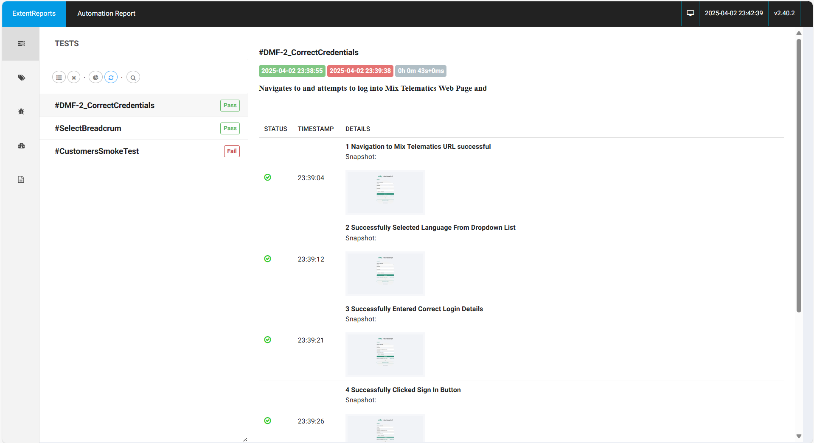
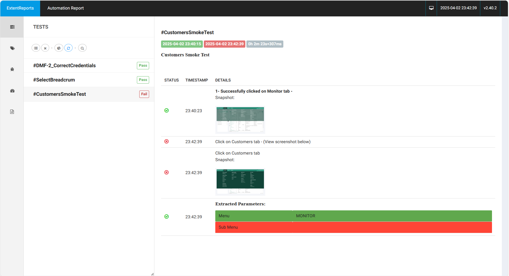
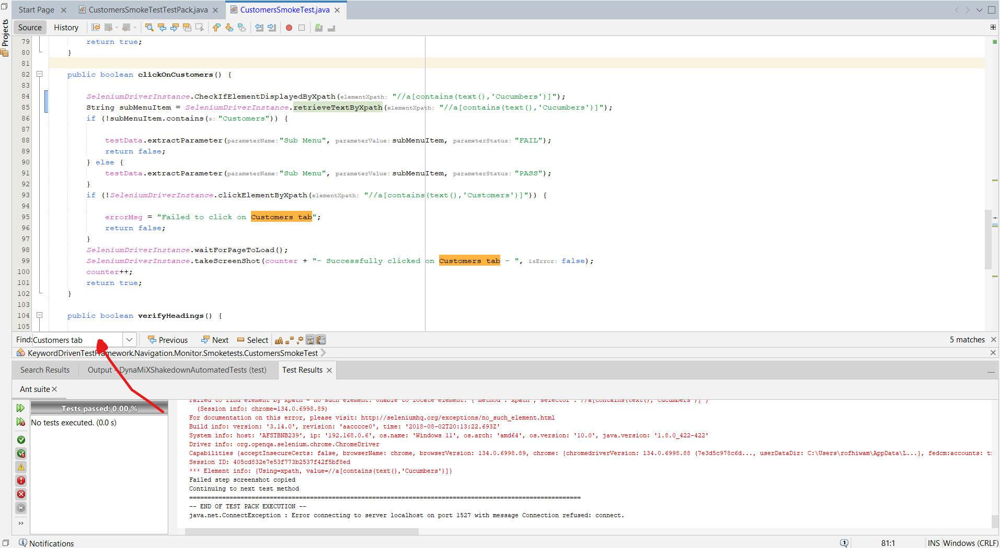
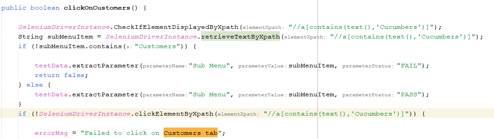
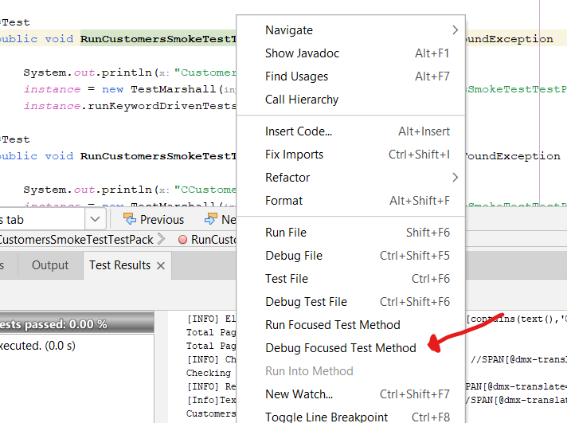
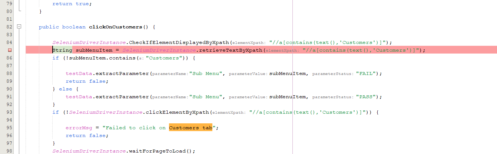
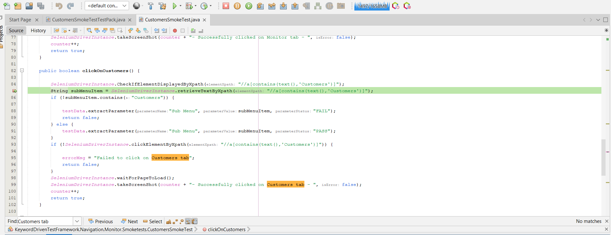

# Debugging Your Java Selenium Tests in NetBeans: A Practical Guide

**Author**: Rofhiwa "Ralph" Matumba

Welcome! Working with Selenium and Java means you'll sometimes need to figure out why a test isn't behaving as expected. Debugging is a core skill, and this guide will help you get comfortable using NetBeans to find and fix issues in your Selenium tests.

## What You'll Need

* **A Working Selenium Setup:** Your Java project should be set up with Selenium, and you should be able to run your tests. Some basic familiarity with Java and Selenium concepts will be helpful.
* **Apache NetBeans:** Version 8.2 or later is recommended. This guide uses NetBeans 17, but the principles apply to other recent versions and similar enterprise-level Java IDEs (like IntelliJ IDEA or Eclipse) that support Java 8+.

## Example Scenario: Investigating a Failed Selenium Test

Let's say a test passes on your machine but fails in your Continuous Integration (CI) environment (like Jenkins), or maybe it just started failing locally. The first step is to reproduce and investigate the failure in your development environment (NetBeans).

1. **Run the Test Locally:** Identify the specific test method in your Java file (`.java`) that's failing and run it directly within NetBeans.
2. **Locate the Test Report:** After the run, find the generated test report. Many Selenium projects use tools like ExtentReports, TestNG reports, or Surefire reports.
    * *Example with ExtentReports:* Navigate to the project's test report output folder (`KeywordDrivenTestReports`) and find the relevant HTML report file (`extentReport.html`).
    * *The Goal:* Open the report to see a summary of test results.

3. **Analyze the Failure in the Report:** Look for the test case marked as failed.

     *(This image shows an example ExtentReport overview)*

4. **Examine the Failure Details:** Click on the failed test name to get more information. Pay attention to:
    * **Error Message/Exception:** Java exceptions (like `NoSuchElementException`, `TimeoutException`, `AssertionError`) and specific error messages are crucial clues.
    * **Stack Trace:** This shows the sequence of method calls leading to the error, helping you pinpoint the exact line in *your* code where the problem surfaced.
    * **Screenshots/Timestamps:** Many reporting tools capture a screenshot at the point of failure, which is incredibly helpful for UI issues. Timestamps can help understand timing problems.

     *(This image shows detailed results for a failed test, often including error messages)*

    In this example report, the failure description indicates a problem occurred while trying to interact with the "Customers" tab.

5. **Find the Code:** Use the information from the report (like the element description "Customers tab" or the specific exception) to search your code.
    * In NetBeans, press **Ctrl+F** to open the search bar (usually appears at the bottom).
     *(NetBeans search bar location)*

    * Searching for `Customers tab` (or a relevant part of the locator or error message) leads you to the relevant lines in your `.java` file.
     *(Search results highlighting the term in the code)*

6. **Identify and Fix:** Inspect the highlighted code.
    * *In this specific example:* A closer look reveals a typo in an XPath expression. The code was searching for `//a[contains(text(),'Cucumbers')]` instead of `//a[contains(text(),'Customers')]`. Selenium couldn't find the element because the text didn't match.
     *(Shows the code after fixing the XPath typo)*
    * Correcting the XPath typo and rerunning the test resolved this particular issue. Common issues found this way include incorrect locators (XPath, CSS selectors, IDs), typos in expected text, or incorrect assumptions about the application's state.

## Debugging When Errors Aren't Obvious (Using NetBeans Debugger)

Sometimes the report doesn't immediately tell you *why* something failed, especially with complex test logic or unexpected application behavior. This is where the NetBeans debugger shines.

### Running Tests in Debug Mode

Instead of just running the test, you'll attach the debugger:

1. **Right-click** on the specific test method name (or the test class) in your Java file.
2. Select **"Debug Focused Test Method"** (or "Debug Test File" if debugging the whole class). *Do not* select "Run Focused Test Method".

 *(Shows the right-click menu with 'Debug Focused Test Method')*

Simply starting in debug mode won't change how the test runs *until* you set breakpoints.

### Using Breakpoints

Breakpoints tell NetBeans where to pause the execution of your test.

1. **Set a Breakpoint:** Click in the left margin next to the line number where you want to pause. A pink/red square or icon will appear, often highlighting the line. Choose a line *before* the code you suspect is causing trouble.
     *(A breakpoint indicator appears next to the line number)*

2. **Start Debugging:** Run the test using **"Debug Focused Test Method"**.
3. **Execution Pauses:** When the test execution reaches your breakpoint, it will pause. The line is usually highlighted (often in green), and the debugging toolbar appears (typically at the top).
     *(Shows the green highlight on the paused line and the debug toolbar)*

### Understanding the NetBeans Debugging Controls

The debugging toolbar provides precise control over execution:

* **Stop:** Terminates the entire debug session.
* **Pause:** Manually pause execution if it's currently running.
* **Continue (F5):** Resumes running until the next breakpoint is hit or the test ends.
* **Step Over (F8):** Executes the current highlighted line fully. If it contains a method call, the entire method is executed without stepping into it. Pauses on the next line in the *current* method. *Use this to move line-by-line within the current scope.*
* **Step Over Expression (Shift+F8):** Executes only the *next logical part* (subexpression or method call) on the current line. Useful for complex lines with multiple chained method calls.
* **Step Into (F7):** If the current line calls one of *your* methods, execution jumps to the first line inside that method. *Use this to dive deeper into your own functions.*
* **Step Out (Ctrl+F7):** Continues execution until the current method finishes and returns to the line where it was called. *Use this to quickly exit a method you've stepped into.*

**Why Use the Debugger?** By pausing execution, you can:

* **Inspect Variables:** Check the current values of variables in the 'Variables' window in NetBeans.
* **Evaluate Expressions:** Use the 'Watches' window to evaluate custom expressions.
* **Trace Logic:** Step through the code line-by-line to understand exactly how your test logic flows. This is invaluable for diagnosing complex logical errors.

*If you discover other effective debugging strategies within NetBeans for Selenium, feel free to share them!*

Happy testing!
