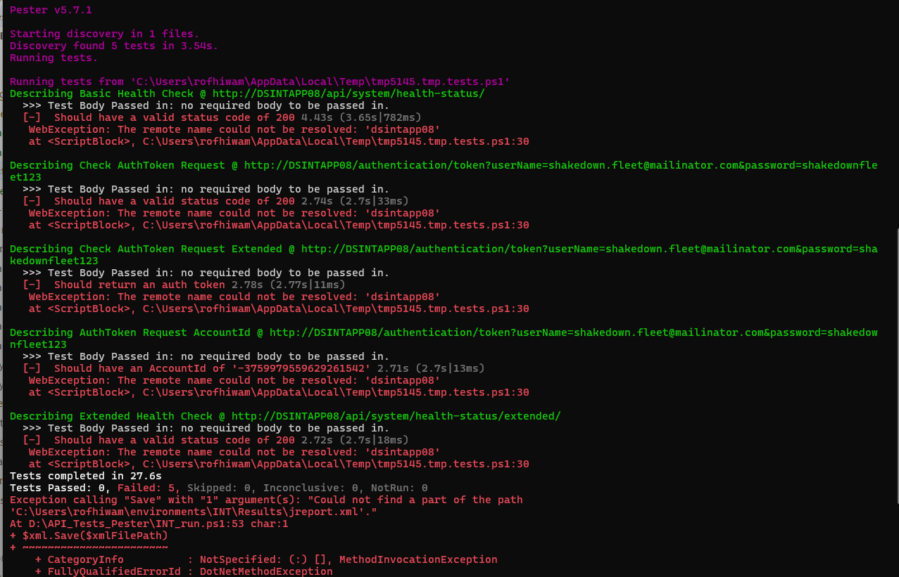

# Getting Started with Pester for PowerShell Testing

**Author:** Rofhiwa 'Ralph' Matumba

Welcome! Pester is a fantastic testing framework designed specifically for PowerShell. It helps you write automated tests for your PowerShell scripts, functions, and modules, ensuring they work as expected. This guide will walk you through setting up Pester, particularly focusing on the configuration needed for the `API_Tests_Pester` project.

## Step 1: Allowing PowerShell Scripts to Run (Execution Policy)

First, we need to make sure PowerShell will allow you to run scripts, including Pester tests. PowerShell has a security feature called "Execution Policy" to prevent potentially harmful scripts from running unintentionally.

* **Already Done This?** If you've previously set up Scoop and Allure following the Playwright tutorial ([**Scoop and Allure** section](../web-testing/playwright-windows.md#2-installing-scoop-and-allure-for-reports)), you likely already have the correct execution policy set and can skip to the next section.
* **Need to Check/Set it?** Follow these steps:

    1. **Open PowerShell as an Administrator.** (Right-click the PowerShell icon and choose "Run as administrator"). This is important because changing execution policies requires admin rights.
    2. **Check your current policy:** Type the following command and press Enter:

    ```powershell
        Get-ExecutionPolicy
    ```

3. **Understand the Output:** You'll see one of these common policies:
        * `Restricted`: Default setting. Doesn't run scripts.
        * `AllSigned`: Only runs scripts signed by a trusted publisher.
        * `RemoteSigned`: Allows local scripts to run, but scripts downloaded from the internet must be signed by a trusted publisher. **This is generally the recommended setting for development.**
        * `Unrestricted`: Runs all scripts, but warns you if running scripts downloaded from the internet.
        * `Bypass`: Runs everything with no warnings or prompts.
    4. **Set the Policy (If Needed):** To allow local scripts (like your Pester tests) and signed remote scripts to run, execute this command in the administrator PowerShell window:

    ```powershell
        Set-ExecutionPolicy RemoteSigned -Scope CurrentUser -Force
    ```

    * `-Scope CurrentUser`: This applies the policy only to your user account, which is safer than changing it system-wide.
        * `-Force`: Suppresses confirmation prompts.
    5. **Verify the Change:** Run `Get-ExecutionPolicy` again to confirm it now shows `RemoteSigned`.
    6. **Keep the Admin Window:** Please keep the administrator PowerShell window open for the next step.

## Step 2: Installing Pester (The Right Way)

Now, let's install Pester itself.

1. **Attempt Standard Installation:** In your **administrator** PowerShell window, try installing Pester using the standard command:

```powershell
    Install-Module -Name Pester -Force -SkipPublisherCheck
```

* `-Force`: Installs even if a version is already present.
    * `-SkipPublisherCheck`: Often needed if running behind certain proxies or firewalls.

2. **Check for Conflicts (Important!):** Sometimes, Windows includes an older, built-in version of Pester that can conflict with the newer version required by test projects like `API_Tests_Pester`. After running the install command, verify you have the latest version (see "Verifying Pester Installation" below). If verification fails or you encounter issues later *specifically related to Pester version conflicts*, you might need the more advanced steps below.

3. **(Advanced - Use Only If Necessary): Forcefully Replacing the System Pester:**
    * **Caution:** The following commands forcefully take ownership of and remove the system-installed Pester module. This is generally **not recommended** unless you are sure the standard `Install-Module -Force` or `Update-Module` did not correctly override the built-in version and it's causing compatibility problems with your tests. Use with care.
    * If you've confirmed the standard install isn't working due to the built-in module, run these commands **line-by-line** in the **administrator** PowerShell window:

    ```powershell
        # Define path to the potentially problematic built-in module
        $module = "C:\Program Files\WindowsPowerShell\Modules\Pester"

        # Take ownership of the folder (requires admin rights)
        & takeown.exe /F $module /A /R

        # Reset permissions on the folder
        & icacls.exe $module /reset

        # Grant Full Control to Administrators group (S-1-5-32-544 is the SID for Administrators)
        & icacls.exe $module /grant "*S-1-5-32-544:F" /inheritance:d /T

        # Forcefully remove the old module folder
        Remove-Item -Path $module -Recurse -Force -Confirm:$false

        # Now, try installing the latest Pester cleanly
        Install-Module -Name Pester -Force -SkipPublisherCheck
    ```

* This complex process only needs to be done **once** if you encounter this specific conflict.

4. **Updating Pester in the Future:** To update Pester later, simply run:

```powershell
    Update-Module -Name Pester
```

### Verifying Pester Installation

Confirm Pester is installed correctly and check its version by running this in any PowerShell window (admin rights not needed for verification):

```powershell
Get-Module Pester -ListAvailable | Select-Object Version, Path
# Or simply:
pester --version
```

If you see a version number (ideally v5 or later for modern features), you're good to go! If not, carefully review the installation steps or check the [official Pester installation guide](https://pester.dev/docs/introduction/installation/).

## Step 3: Running the API Pester Tests (Specific Project)

This section details how to run tests from a specific repository that uses Pester.

1. **Get the Code:** Clone the `API_Tests_Pester` repository to a location on your computer (using `D:\` is suggested, but any location works). You can find it here: [**API Tests Pester**](https://dev.azure.com/MiXTelematics/AutomatedTests/_git/API_Tests_Pester) (Note: You'll need access to this Azure DevOps repository). Use `git clone <repository_url>` in PowerShell or your preferred Git tool.

2. **Navigate to the Repository:** Open PowerShell (a regular, non-admin window is fine now) and change directory (`cd`) into the cloned `API_Tests_Pester` folder.

```powershell
cd D:\path\to\cloned\repo\API_Tests_Pester
```

3. **Install Node.js Dependencies:** This particular project also uses Node.js for some tooling or setup.
    * **Need Node.js?** If you don't have Node.js installed, refer to the setup instructions (e.g., the [**Chrome, ChromeDriver, and Node.js** section](../web-testing/selenium.md#2-install-chrome-browser-chromedriver-and-nodejs) mentioned in the Selenium tutorial, or download from [nodejs.org](https://nodejs.org/)).
    * **Install Project Dependencies:** Once Node.js is ready, run the following command in the repository's root directory. This downloads the necessary Node.js packages defined in the project's `package.json` file.

```powershell
npm install
```

4. **Run the Pester Tests:** The repository contains specific scripts to execute the tests. To run the suite configured for the 'INT' environment, execute:

```powershell
.\INT_run.ps1
```

5. **Interpreting the Output & Caveat:** Pester will start running the tests defined in the project. You should see output indicating tests starting, passing (`[+]`), or failing (`[-]`).

     *(Shows example console output during a Pester test run)*

    * **Important Note (as of April 15, 2025):** Please be aware that the tests within *this specific* `API_Tests_Pester` repository were unstable. While Pester itself should function correctly after the setup described above, the test results from `.\INT_run.ps1` might show inconsistencies or failures unrelated to your setup. If the reliability of these specific tests improves, this note should be updated.

You've now successfully set up Pester and run tests from the target repository!

Happy testing!
