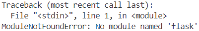
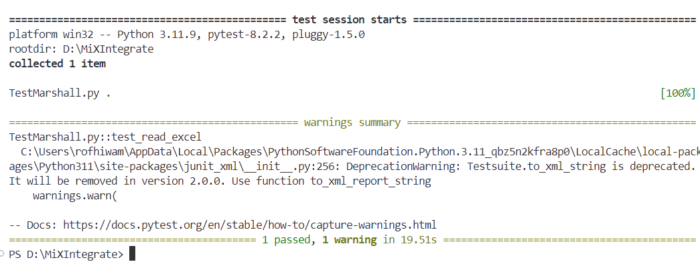

# Getting Started with Pytest for Python Testing

**Author:** Rofhiwa 'Ralph' Matumba

Welcome to Pytest! It's a very popular and powerful testing framework for Python that makes writing and running tests straightforward and efficient. This guide will help you set up your Python environment, install Pytest, and get ready to run tests, specifically using the `MiXIntegrate` project as an example.

## Step 1: Checking Your Python Installation

Pytest requires Python. Many systems, especially macOS and Linux, come with Python pre-installed. Let's check if you have Python 3, which is needed for modern development.

1. **Open your terminal** (PowerShell on Windows, Terminal on macOS/Linux).
2. **Run the version check command:**

```bash
python --version

# Or sometimes on systems with both Python 2 and 3:
python3 --version
```

1. **Check the result:** If you see a version number like `Python 3.x.x` (version 3.6 or higher is recommended), you're ready to proceed! If not, or if you want the latest version, follow one of the installation methods below.

### Installing Python (If Needed)

Here are common ways to install Python on Windows:

#### Method 1: Using `winget` (Windows Package Manager)

* `winget` is a command-line tool built into recent Windows versions for easy software installation.
* In PowerShell, run:

```bash
winget install Python.Python.3
```

  * This command finds the latest stable Python 3 release from the official source and installs it. You might be prompted for permissions – answering `[A] Yes To All` is usually fine. `winget` typically handles adding Python to your PATH automatically.

#### Method 2: Using the Official Installer

* This is the standard method and works on all systems.
* Go to the official Python downloads page: [python.org/downloads/](https://www.python.org/downloads/)
* Download the latest stable installer for your operating system (Windows, macOS).
* Run the installer. **Crucially:** During installation (especially on Windows), check the box that says **"Add Python 3.x to PATH"**. This allows you to run `python` from any terminal window. Use the default installation settings otherwise.

**Verify After Installing:** Close and reopen your terminal/PowerShell window, then run `python --version` (or `python3 --version`) again to confirm the installation worked and the command is recognized. If the command isn't found, you may need to manually add Python's installation directory to your system's PATH environment variable.

## Step 2: Getting the Project Code

Now, let's get the code for the specific project that uses Pytest.

1. **Clone the Repository:** Use Git to clone the `MiXIntegrate` repository. You'll need access permissions for this specific Azure DevOps repository.

```bash
# Example using Git command line:
git clone https://MiXTelematics@dev.azure.com/MiXTelematics/AutomatedTests/_git/MiXIntegrate
```

1. **IMPORTANT Folder Name:** Ensure the folder created by cloning is named **exactly** `MiXIntegrate` (case-sensitive). Some scripts or configurations within the project rely on this specific name. If Git clones it to a different name, rename the folder immediately.

## Step 3: Installing Project Dependencies with `pip`

Python projects rely on external libraries (packages) for various functionalities. `pip` is Python's standard package manager used to install these.

1. **Navigate to the Project Directory:** Open your terminal/PowerShell and change directory (`cd`) into the `MiXIntegrate` folder you just cloned.

```bash
cd path\to\your\cloned\repo\MiXIntegrate
```

1. **(Recommended Best Practice) Use a Virtual Environment:** Before installing packages, it's highly recommended to create a virtual environment. This creates an isolated space for your project's dependencies, preventing conflicts with other Python projects on your system.

```bash
# Create a virtual environment (common convention is to name it .venv or venv)
python -m venv .venv

# Activate the virtual environment
# On Windows (PowerShell):
.\.venv\Scripts\Activate.ps1
# On Windows (cmd.exe):
.\.venv\Scripts\activate.bat
# On macOS/Linux (bash/zsh):
source .venv/bin/activate
```

Your terminal prompt will usually change to show `(.venv)` when active. Activate it each time you work on the project.

1. **Install from `requirements.txt`:** Most Python projects list their dependencies in a file named `requirements.txt`. This project includes one. To install everything listed in that file, run:

```bash
pip install -r requirements.txt
```

* `pip`: The Python package installer command.
* `install`: The action to perform.
* `-r requirements.txt`: Tells `pip` to read package names and versions from the specified file and install them.

1. **Handling Missing Packages Manually (If Needed):** Occasionally, you might run a script and get a `ModuleNotFoundError`, meaning a specific library wasn't listed or installed.
    * *Example Error:*
        
    * This error clearly states Python couldn't find the `Flask` module.
    * *Solution:* Install it directly using `pip`:

```bash
pip install flask
```

(Replace `flask` with the actual missing module name). Then try running your script again. If you install a package manually that the project needs, consider adding it to the `requirements.txt` file.

## Step 4: Verifying Pytest Installation

Since Pytest is likely listed in the `requirements.txt` file, the previous `pip install -r` command should have installed it. Let's verify.

1. **Open the Python Interactive Shell:** In your terminal (with your virtual environment active if used), type:

```bash
python
```

You should see `>>>` indicating you're in the Python interpreter.
2. **Try Importing Pytest:** Type the following and press Enter:

```python
import pytest
```

1. **Check the Result:** If you see *no error message* and just get the `>>>` prompt back, it means Python successfully found and imported the Pytest library. Success!
2. **Exit the Python Shell:** Type `exit()` and press Enter to return to your regular terminal prompt.

## Step 5: Running Your First Pytest Test (MiXIntegrate Example)

With Python, project dependencies, and Pytest ready, you can now run the tests included in the `MiXIntegrate` repository.

1. **Ensure you are in the `MiXIntegrate` directory** in your terminal (and your virtual environment is active if used).
2. **Run the UAT Tests:** Use the following command (this specific command structure is defined by how the `MiXIntegrate` project is set up):

```bash
python -m pytest TestMarshall.py --testfile "Test Packs\UAT PACK.xlsx"
```

* `python -m pytest`: Runs Pytest as a module, ensuring it uses the correct Python environment.
* `TestMarshall.py`: The main test execution script or file entry point for this project.
* `--testfile "Test Packs\UAT PACK.xlsx"`: A custom argument passed to the tests, specifying the test pack configuration (in this case, an Excel file for the UAT environment).

1. **Observe the Output:** Pytest will discover and run the tests. You should see output indicating test progress (dots `.` for pass, `F` for fail, `E` for error, `s` for skip) and a summary at the end.

     *(Shows typical console output from a Pytest run, including a summary)*

If you see output similar to the image, indicating tests were run and summarized, congratulations! Your environment is set up correctly, and you're ready to work with Pytest in this project. If you encounter errors, carefully review the setup steps, error messages, and project-specific documentation.
