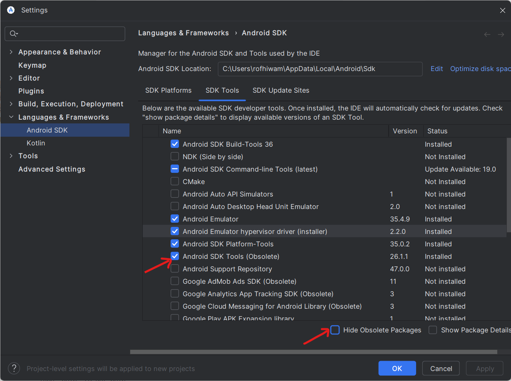

# Getting Started with Android Testing using Appium, Java & Maven

**Author:** Rofhiwa 'Ralph' Matumba

Welcome to the world of Android automated testing! This guide will walk you through setting up your environment using Appium, Java (specifically a recent JDK), Maven, and Android Studio. While the setup involves several components, following these steps will get you ready to run tests for the `MobileTests` project.

**Important Note!** (As of April 15, 2025) This tutorial describes setup for a test pack that was under active development. Some details or project specifics might evolve, so always check for the latest project documentation if available.

## Step 1: Install the Required Java Development Kit (JDK)

This project requires a recent JDK version, specifically **OpenJDK 24** (as of April 2025).

1. **Download OpenJDK 24:** Get it from the official source: [Download OpenJDK 24](https://jdk.java.net/24/) (Download the ZIP archive for Windows).
2. **Extract:** Unzip the downloaded file to a suitable location on your computer (e.g., `D:\jdks\openjdk-24`). Remember this path, as you'll need it later.

### Managing Multiple JDKs (`JAVA_HOME`)

You might have other Java versions installed (like JDK 8 for web testing). To ensure this project uses JDK 24 *without* disrupting your other setups, you need to temporarily tell the system where to find JDK 24 when running these specific tests. The `JAVA_HOME` environment variable does this.

**Running Tests with a Batch Script (One Method):**

Here's a template for a Windows Batch (`.bat`) script that temporarily sets `JAVA_HOME` to your JDK 24 path, runs the Maven tests, and then sets `JAVA_HOME` back.

**⚠️ SECURITY WARNING: NEVER hardcode passwords or API keys directly in scripts!** Use environment variables for credentials. You must set these variables in your system *before* running the script.

```cmd
@echo off
ECHO Setting environment for Mobile Tests...

REM --- SET YOUR CREDENTIALS SECURELY AS ENVIRONMENT VARIABLES ---
REM Example (do this in System Properties -> Environment Variables, NOT here):
REM SET LAMBDATEST_USER=your_lambdatest_username
REM SET LAMBDATEST_PWD=your_lambdatest_access_key

REM --- CONFIGURE YOUR JDK PATHS HERE ---
SET "JDK24_PATH=D:\jdks\openjdk-24"  REM <-- *** CHANGE THIS to your actual JDK 24 path ***
SET "JDK8_PATH=C:\path\to\your\jdk8" REM <-- *** CHANGE THIS to your actual JDK 8 path ***

REM Temporarily set JAVA_HOME to JDK 24
ECHO Setting JAVA_HOME to %JDK24_PATH%
SET "JAVA_HOME=%JDK24_PATH%"

REM Verify Java version (optional)
REM java -version

REM Run the Maven tests (Maven needs to be in your system PATH)
ECHO Running Maven tests...
mvn test

REM Restore JAVA_HOME to JDK 8 (or your default)
ECHO Restoring JAVA_HOME to %JDK8_PATH%
SET "JAVA_HOME=%JDK8_PATH%"

ECHO Done.
pause
```

**To use this script:**

1. Copy the text above.
2. **Set your LambdaTest username and access key as persistent Environment Variables** in your Windows System Properties. Search for "Edit the system environment variables". Do NOT put them directly in the script.
3. Modify the `JDK24_PATH` and `JDK8_PATH` lines in the script to match the actual locations on your computer.
4. Save the file with a `.bat` extension (e.g., `run_mobile_tests.bat`).
5. Double-click the `.bat` file to run the tests using JDK 24.

## Step 2: Install Android Studio & SDK

Android Studio is Google's official IDE for Android development. We need it for the Android Software Development Kit (SDK), virtual devices, and other essential tools.

1. **Download Android Studio:** Get the latest version (referred to as "Meerkat" around April 2025) from the official site: [Download Android Studio](https://developer.android.com/studio)
2. **Install:** Run the installer, accepting the default settings.
3. **Setup Wizard:**
    * When asked about usage statistics, choosing "Don't Send" is fine.
    * Select the "Standard" installation type.
4. **Install Specific SDK Components:** Once Android Studio opens to the "Welcome" screen:
    * Click "More Actions" (bottom right) -> "SDK Manager".
    * **SDK Platforms Tab:** Ensure **Android 7.1.1 (Nougat)** is checked. This installs the platform version the tests might target or interact with. Click Apply/OK if you check it.
    * **SDK Tools Tab:**
        * Uncheck "Hide Obsolete Packages" at the bottom.
        * Check the box for **Android SDK Tools (Obsolete)**. This is needed for the `uiautomatorviewer` tool, which helps inspect app elements and find their locators (like XPaths) for Appium.
        * Click "Apply" or "OK" to install the selected components.

 *(Shows the SDK Manager)*

### Creating an Android Virtual Device (AVD)

An AVD (or emulator) lets you run an Android device simulation on your computer.

1. From the "Welcome to Android Studio" window: "More Actions" -> "Virtual Device Manager".
2. Click the `+` (Create device) button.
3. Choose a device definition (e.g., a Pixel model) -> "Next".
4. Select a system image (like Android 7.1.1 if available, or another API level) -> "Next". You might need to download the system image first.
5. Review the configuration and click "Finish". You can now launch this virtual device from the Virtual Device Manager.

## Step 3: Install Apache Maven

Maven is a powerful build tool for Java projects. It manages dependencies, compiles code, runs tests, and packages the application. It's used here to ensure tests run consistently locally and potentially on cloud platforms like LambdaTest.

1. **Download Maven:** Get the latest Binary ZIP archive (e.g., `apache-maven-3.9.9` as of April 2025) from the official site: [Download Maven](https://maven.apache.org/download.cgi)
2. **Extract:** Unzip the downloaded file to a stable location (e.g., `D:\tools\apache-maven-3.9.9`).
3. **Add Maven to PATH:** This is crucial! You need to add Maven's `bin` directory to your system's PATH environment variable so you can run `mvn` from any terminal.
    * Find the path to the `bin` folder inside where you extracted Maven (e.g., `D:\tools\apache-maven-3.9.9\bin`).
    * Search Windows for "Edit the system environment variables", open it, click "Environment Variables...", select the "Path" variable under "System variables" (or "User variables"), click "Edit...", click "New", and paste the full path to Maven's `bin` directory. Click OK on all dialogs.
    * Verify by opening a *new* terminal window and typing `mvn -version`. You should see Maven's version information.

## Step 4: Install Appium

Appium is the automation framework that bridges your test scripts (Java) with the Android application.

1. **Install Appium Server:** This requires Node.js and npm (Node Package Manager). If you don't have them, install Node.js first (visit [nodejs.org](https://nodejs.org/)). Then, open your terminal/PowerShell and run:

```powershell
npm install -g appium
```

* `-g` installs Appium globally so you can run it from anywhere.
1. **Install the Android Driver (UIAutomator2):** Appium needs specific drivers for different platforms. For modern Android testing, install the UIAutomator2 driver:

```powershell
appium driver install uiautomator2
```

## Step 5: Get the Project Code

Clone the specific repository containing the mobile tests.

1. **Clone:** Use Git to clone the `MobileTests` repository (ensure you have access permissions):

```bash
git clone https://MiXTelematics@dev.azure.com/MiXTelematics/AutomatedTests/_git/MobileTests
```

* *Important:* Make sure you clone `MobileTests` and not the similarly named `MobileRegression` repository if that exists.

## Step 6: Running the Mobile Tests

Now, let's put it all together to run a test locally.

1. **Start Your Android Device:**
    * Launch the AVD you created earlier from the Android Studio Virtual Device Manager. Wait for it to fully boot up.
    * **OR** Connect a physical Android device via USB cable. Make sure [USB Debugging](https://www.lifewire.com/enable-usb-debugging-android-4690927) is enabled in the Developer Options on the device.
2. **Start the Appium Server:** Open a *new* terminal/PowerShell window (keep it separate) and run:
```powershell
appium --relaxed-security --base-path /wd/hub
```
* `--relaxed-security`: May be needed to enable certain automation features. Understand the security implications if using this flag in sensitive environments.
* `--base-path /wd/hub`: Standard base path for WebDriver-compatible clients.
* **Timing is important:** Ensure the AVD is fully running *before* you start the Appium server. Appium needs to detect the device.
1. **Configure for Local Execution (Modify Code):**
  * Open the cloned `MobileTests` repository in your IDE (like VS Code or IntelliJ).
  * Navigate to the file: `src/test/java/com/mixtelematics/automatedtesting/AppTest.java`.
  * Find the test method `testLoginCorrectCredentials()`. Inside this method, locate the call to a function named `startDriver()`.
  * This `startDriver()` function takes a boolean `remote` parameter. **Change its value to `false`**:

```java
// Example change:
startDriver(remote: false); // Set remote flag to false for local run
```

* *Why?* Setting `remote` to `false` tells the test framework to connect to the *local* Appium server (at `http://127.0.0.1:4723/wd/hub` by default) instead of a remote cloud service like LambdaTest. This is necessary for running against your local emulator or device. Remember to change it back if you need to run remotely later.
  
1. **Execute the Tests:** You have two main options:
    * **Option A: Using the Batch Script:**
        * Make sure you've set your LambdaTest credentials as environment variables (as described in Step 1).
        * Make sure the JDK paths in the script are correct.
        * Double-click the `.bat` file you created earlier. It will set `JAVA_HOME` to JDK 24 and run `mvn test`.
    * **Option B: Using VS Code Java Runtime Configuration:**
        * Open the project in VS Code.
        * Press **Ctrl+Shift+P** to open the command palette.
        * Type `Java: Configure Java Runtime`.
        * Under "Project JDKs", ensure the `MobileTests` project is configured to use your installed **JDK 24**. You might need to add it if it's not listed.
        * Open the `AppTest.java` file.
        * Click the "Run Test" or "Debug Test" icon/link that appears next to the `testLoginCorrectCredentials()` method definition (or another test method). This runs the test directly using the JDK configured in VS Code.

2. **Check Output:** Observe the terminal where you ran `mvn test` or the VS Code test output. Look for test results. If you encounter a `NullPointerException` or connection errors, double-check all previous steps, especially ensuring the AVD/device is running, Appium server started correctly *after* the device, and the `remote` flag is set to `false`.

You should now have a working setup for running these Android tests locally!

Happy testing!
