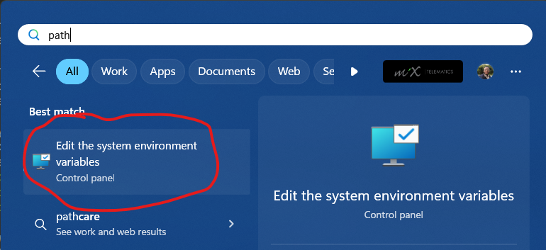
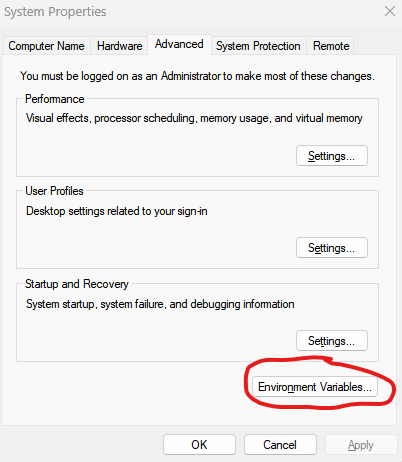
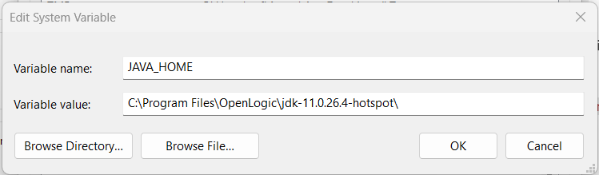

# Getting Started with Selenium

## Dependencies

Before starting with Selenium, make sure you have the necessary dependencies installed.

### Java Development Kit (JDK) and NetBeans

#### OpenJDK
Firstly, install Java Development Kit (OpenJDK) version 8.

- [Download OpenJDK 8](https://builds.openlogic.com/downloadJDK/openlogic-openjdk/8u422-b05/)

#### NetBeans

The recommended IDE to use with OpenJDK 8 is NetBeans, version 18 or lower will work. You can download NetBeans 17 [here](https://archive.apache.org/dist/netbeans/netbeans-installers/17/).

### Chrome, ChromeDriver, and Node.js

Next, you'll need to install the latest version of Chrome for Testing, along with ChromeDriver, which enables Selenium (and other web testing frameworks) to interact with Chrome.

Chrome for Testing and ChromeDriver can be installed via Node.js, which is a cross-platform runtime environment based on JavaScript.

- [Download Node.js (latest)](https://nodejs.org/en)

To verify Node.js installation, run these commands in Windows PowerShell:
```bash
$ node --version
$ npm --version
```
You should see version numbers for Node.js and npm. If not, follow the steps [here](#setting-up-environment-variables).

Once Node.js is installed, install Chrome for Testing and ChromeDriver by running these commands in PowerShell:
```bash
$ npm install -g @puppeteer/browsers
$ npx @puppeteer/browsers install chromedriver@stable
$ npx @puppeteer/browsers install chrome@stable
```
This installs the most recent stable version of Chrome, ChromeDriver, and a simple browser driver through Node.js.

## Setting up Environment Variables

After installing OpenJDK, Chrome, and ChromeDriver, set up your environment variables. In your Windows search bar, type "path" and select "Edit system environment variables".



This opens System Properties. Click "Environment Variables" in the bottom-left corner.



You'll see user and system environment variables. Modify system variables for system-wide changes.

To add new system environment variables:
1. Click "New".
2. Specify variable name and value.

For Java installation, set variable name as *JAVA_HOME* and value to your OpenJDK 8 installation directory. Assuming default installation, it should be `C:\Program Files\OpenLogic\jdk-8.0.422.05-hotspot\`.



For Chrome and ChromeDriver, move installations to a `D:\` drive. If you lack a `D:\` drive, partition your drive. [Here's](https://support.microsoft.com/en-us/windows/create-and-format-a-hard-disk-partition-bbb8e185-1bda-ecd1-3465-c9728f7d7d2e) a guide. Alternatively, use an external disk drive recognized as `D:\`.

Chrome should be in `D:\Chrome\chrome-win64`, and ChromeDriver in `D:\chromedriver\chromedriver-win64`.

Save changes and restart your computer.

## Continue to
- [Git](getting-started/web-testing/git.md)
- [Azure](getting-started/web-testing/azure.md)

That's it! You're ready to start testing with Selenium.