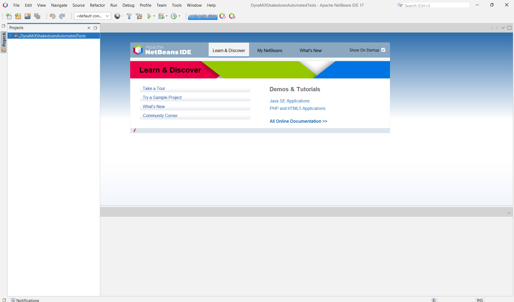

# Getting Started with Selenium WebDriver in Java

Welcome! This guide will walk you through setting up your Windows environment to run automated web tests using Selenium WebDriver with Java and the NetBeans IDE. We'll install the necessary tools step by step.

## 1. Install Java Development Kit (JDK) and NetBeans IDE

First, you need the Java environment and a place to write your code.

### OpenJDK 8

The Selenium test projects in this setup require **Java 8 (OpenJDK 8)** to run correctly due to specific dependencies and compatibility.

* **Download:** Get OpenJDK 8 (select Java 8, your OS, architecture, and JDK package) from a reliable provider like OpenLogic: [Download OpenJDK 8](https://www.openlogic.com/openjdk-downloads?field_java_parent_version_target_id=416&field_operating_system_target_id=436&field_architecture_target_id=391&field_java_package_target_id=396)
* **Install:** Extract the downloaded archive to a location like `C:\Program Files\Java\` or `D:\jdks\`. Remember the full path to the installation directory (e.g., `C:\Program Files\Java\jdk-8.0.422.05-hotspot`).

### NetBeans IDE

An Integrated Development Environment (IDE) helps you write, run, and debug code. For compatibility with Java 8, use **NetBeans version 18 or older**. This guide uses NetBeans 17.

* **Download:** Get the installer for NetBeans 17 from the Apache archive: [Download NetBeans 17](https://archive.apache.org/dist/netbeans/netbeans-installers/17/)
* **Install:** Run the installer using the default settings.

## 2. Install Chrome Browser, ChromeDriver, and Node.js

Selenium controls web browsers using special programs called **WebDriver executables**. For testing with Google Chrome, you need Chrome itself and the corresponding ChromeDriver. We'll use Node.js and its package manager (npm) along with a helper tool (`@puppeteer/browsers`) to easily download and manage compatible versions.

### Node.js (and npm)

* **Download & Install Node.js:** Get the LTS (Long Term Support) version from the official site:
  * [Download Node.js](https://nodejs.org/en)
    Run the installer with default settings (ensure "Add to PATH" is checked).
* **Verify Installation:** After installation, open PowerShell or Command Prompt and check the versions:

```bash
node --version
npm --version
```

If you see version numbers, Node.js and npm are ready. If not, check your system's PATH environment variable (see next section).

### Install Chrome and ChromeDriver via npm

Now, use npm/npx (npx runs packages without needing global install) in your terminal to install the `@puppeteer/browsers` tool and use it to download stable versions of Chrome and ChromeDriver:

```bash
# Install the browser management tool globally (optional, but can be convenient)
npm install -g @puppeteer/browsers

# Use the tool (via npx) to install the correct stable ChromeDriver
npx @puppeteer/browsers install chromedriver@stable

# Use the tool (via npx) to install the stable version of Chrome
npx @puppeteer/browsers install chrome@stable
```

This ensures you get versions of Chrome and ChromeDriver that are known to work well together. Note the download location reported by the tool (you'll need it for the PATH setup).

## 3. Setting Up Environment Variables

Your operating system needs to know where to find the Java JDK and the browser drivers you installed. We configure this using Environment Variables.

### Steps to Edit Environment Variables on Windows

1. In the Windows search bar, type `environment` and select **"Edit system environment variables"**.
2. In the **System Properties** window that opens, click the **"Environment Variables..."** button near the bottom.

### Add `JAVA_HOME` (System Variable)

This variable tells Java-based applications where to find the JDK.

1. Under the **"System Variables"** section (bottom half), click **"New..."**.
2. For **Variable name**, enter `JAVA_HOME`.
3. For **Variable value**, enter the full path to your OpenJDK 8 installation directory (the one you remembered from Step 1), for example:

```text
C:\Program Files\OpenLogic\jdk-8.0.422.05-hotspot\
```

1. Click **OK**.

### Add Chrome and ChromeDriver to `Path` (User Variable)

Adding directories to the `Path` variable allows the system to find executable files (like `chromedriver.exe`) from any terminal location. It's often convenient to keep these on a `D:\` drive if you have one, but place them in a stable location.

* **Recommended Locations (Examples):**
  * Chrome: `D:\Chrome\chrome-win64` (or the path reported by `@puppeteer/browsers install`)
  * ChromeDriver: `D:\chromedriver\chromedriver-win64` (or the path reported by `@puppeteer/browsers install`)

* **Steps to Add to Path:**
    1. In the **Environment Variables** window, under the **"User variables for [YourUsername]"** section (top half), find and double-click the `Path` variable.
    2. Click **"New"**.
    3. Paste the full path to the directory containing `chrome.exe` (e.g., `D:\Chrome\chrome-win64`).
    4. Click **"New"** again.
    5. Paste the full path to the directory containing `chromedriver.exe` (e.g., `D:\chromedriver\chromedriver-win64`).
    6. Click **OK** on all open Environment Variables / System Properties windows.

* **Restart Required:** You **must restart your computer** for these environment variable changes to take full effect system-wide.

## 4. Running Your First Selenium Test

Before starting, ensure you are familiar with basic Git operations for cloning repositories. Refer to our [Git basics guide](../../misc/git.md) if needed.

### Steps

1. **Clone the Repository:** Use Git to clone the `AutomatedTests` repository from Azure DevOps onto your machine.
2. **Open Project in NetBeans:** Launch NetBeans IDE. Go to **File > Open Project...** and navigate to and select the cloned `AutomatedTests` folder.
3. **Locate Test Suites:** The project structure should appear in the **Projects** tab (usually on the left sidebar). Navigate through the project tree to:

    *DynaMiXShakedownAutomatedTests > Test Packages > TestSuites*

     *(Shows the project structure in NetBeans)*

4. **Open a Test File:** Double-click any `.java` file within the `TestSuites` folder to open it in the editor.
5. **Find a Test Method:** Scroll through the code to find a method annotated with `@Test`. These methods typically have names indicating what they test, like:

```java
@Test
public void RunSomeNameSmokeTestTestPackChrome() {
  // Test code inside...
}
```

* The `@Test` annotation marks this Java method as an executable test case for the testing framework (likely TestNG or JUnit).

1. **Run the Test:** Right-click directly on the **method name** (e.g., `RunSomeNameSmokeTestTestPackChrome`) in the editor.
2. Select **"Run Focused Test Method"** from the context menu.

If everything is set up correctly, a new Chrome browser window should open, and Selenium will start interacting with web pages automatically according to the test script. Congratulations – you've successfully run your first Selenium test! If errors occur, carefully review the setup steps and any error messages in the NetBeans output window.
