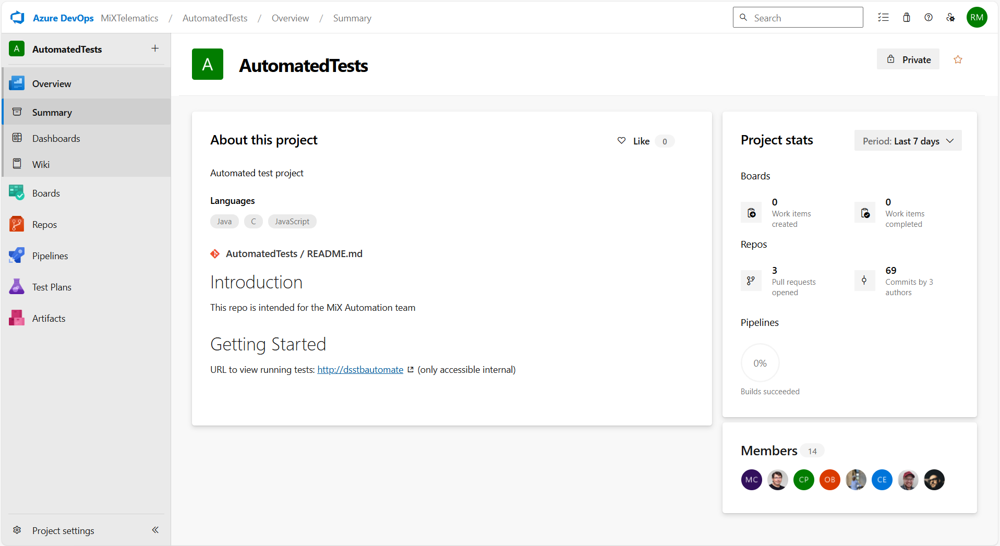

# Getting Started with Azure DevOps Repositories

**Author:** Rofhiwa 'Ralph' Matumba

Welcome! Azure DevOps is the central place where our team stores and manages the code for all our automated tests. Think of it as our shared library for test automation projects. As you work here, you'll frequently interact with these codebases, known as repositories (or "repos"). You can access our Azure DevOps organization here: [MiX Telematics Automated Tests](https://dev.azure.com/MiXTelematics/AutomatedTests).

## Navigating to the Repositories

 *(The main Azure DevOps dashboard)*

When you first land on the Azure DevOps site, you'll see a summary page. To find the code:

1. Look for the navigation menu on the left side.
2. Click on the **"Repos"** link (it usually has an icon like branching code). This section contains all the different code repositories.

Alternatively, this link takes you directly to a specific repository to start: [Example Repo Link](https://dev.azure.com/MiXTelematics/AutomatedTests/_git/PlaywrightV2)

Once you're in the "Repos" section, you'll see the files for one specific repository. To switch between different repositories:

1. Look near the top of the page, usually just below the main header. You'll see the current repository's name (like a breadcrumb trail).
2. Click on the repository name itself. A dropdown list will appear, showing all the repositories you have access to.
3. **For Trainees:** Find and click on **`Training_AutomatedTests`** in the list. This will open your dedicated training repository where you can practice.

## Getting the Code: Cloning a Repository

Before you can work with the code, you need to copy it from Azure DevOps onto your computer. This process is called "cloning". However, before you can clone, Azure DevOps needs to know who you are to grant you access securely.

### Authentication: Connecting Securely

You need to set up either HTTPS or SSH authentication between your machine and Azure DevOps. This tells Azure DevOps that your computer is authorized to access the code.

* **This is a one-time setup per machine.**
* Setting this up involves generating credentials (like a Personal Access Token for HTTPS or an SSH key pair) and configuring Git to use them.
* The detailed instructions are provided by Microsoft and are essential reading before proceeding: **[Azure DevOps Git Authentication Overview](https://learn.microsoft.com/en-us/azure/devops/repos/git/auth-overview)**. Please follow that guide carefully to get your authentication configured.

### Cloning Steps (After Authentication is Set Up)

1. **Navigate to the Repository:** In Azure DevOps online, make sure you have the correct repository open (e.g., `Training_AutomatedTests`).
2. **Find the Clone Button:** Look for a button labeled **"Clone"** (usually near the top right).
3. **Copy the URL:** Clicking "Clone" will reveal options for HTTPS or SSH. Click the copy icon next to the URL type you configured during authentication (HTTPS is often simpler to start with). This copies the repository's unique address to your clipboard.
4. **Open Your Terminal:** Launch PowerShell (or Git Bash, or another command-line terminal).
5. **Navigate to Your Workspace:** Use the `cd` command to move into the directory where you want to store your project code (e.g., `cd D:\Source\Repos`).
6. **Run `git clone`:** Type `git clone` followed by a space, and then paste the URL you copied from Azure DevOps. Press Enter.

    * **HTTPS Example:**

```powershell
git clone https://MiXTelematics@dev.azure.com/MiXTelematics/AutomatedTests/_git/Training_AutomatedTests
```

* **SSH Example:**

```powershell
git clone git@ssh.dev.azure.com:v3/MiXTelematics/AutomatedTests/Training_AutomatedTests
```

Git will now download a complete copy of the repository's code and history into a new folder (named `Training_AutomatedTests` in this example) inside your current directory.

## Quick Guide to Important Repositories

Here's a brief overview of some key test automation repositories you might encounter:

* **Java:**
  * `AutomatedTests`: Contains core Java "shakedown" tests (quick checks to ensure basic functionality is working, often run after a deployment).
  * `DynaMiXRegression`: Holds Java "regression" tests (more extensive tests designed to catch previously fixed bugs and ensure features still work).
  * `MobileRegression`: The older repository for mobile testing (likely being phased out).
  * `MobileTests`: The current/upcoming repository for mobile testing using newer frameworks/approaches.
* **C#:**
  * `PlaywrightRegression`: The C# regression test suite using the Playwright framework.
  * `PlaywrightShakedown`: The main C# shakedown test suite using Playwright (also referred to as `PlaywrightV2` in some contexts).
  * `PlaywrightUnityShakedown`: C# Playwright shakedown tests specifically targeting the Unity platform.
  * `Microsmoketests`: Contains very small, fast C# "smoke tests" (checking the absolute critical paths are working).
  * `PlaywrightWatchdogs`: Holds C# "watchdog" tests (likely tests that monitor system health or availability).

This should help you get started with finding and accessing the code you need from Azure DevOps!
