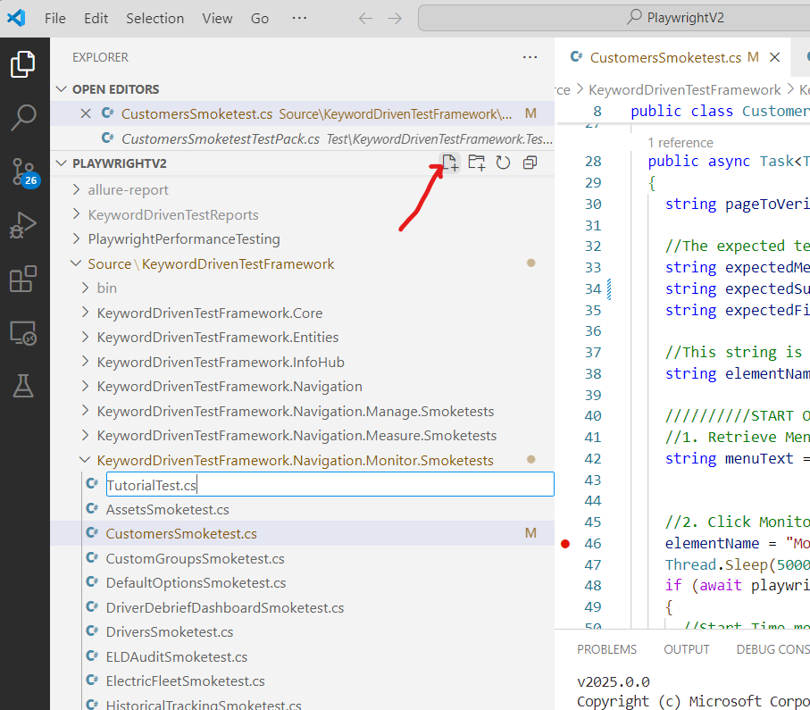
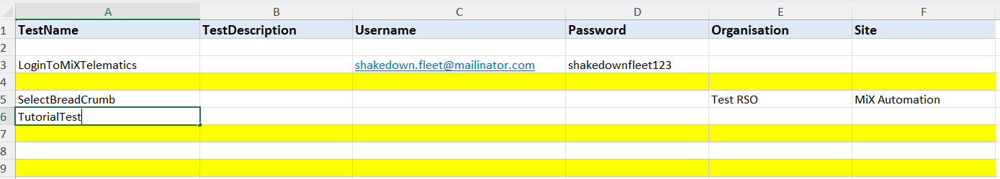

# Playwright: Crafting Your First Test Within the Framework

**Author:** Rofhiwa 'Ralph' Matumba

Ready to write your first test using our Playwright C# framework? This guide will walk you through the specific steps involved. Our framework has a particular structure to keep tests organized and maintainable. While there are a few pieces involved, we'll cover each one clearly.

## Understanding the Codebase Structure

To successfully add and run a new web test in this framework, four key components need to be correctly set up:

1. **Test Source File (`.cs`):** This C# file contains the actual test steps and logic (e.g., clicking buttons, verifying text) using Playwright commands.
2. **`TestMarshall` Registration:** The central `TestMarshall.cs` file acts as a dispatcher. Your new test needs to be registered within its `switch` statement so the framework knows how to execute it based on its name.
3. **Test Pack File (`.cs`):** This separate C# file (often ending in `TestPack.cs`) sets up the execution context for your test, like specifying which environment to run against and which data file to use. It uses the NUnit testing framework for structure.
4. **Excel Spreadsheet File (`.xlsx`):** This file, located in the `TestPacks` directory, contains the test data and execution rules, including the test name that links everything together.

Let's go through creating each of these pieces.

## 1. Developing the Test Source File (`TutorialTest.cs`)

First, we write the code that performs the actual test actions.

1. **Open the Project:** Launch VS Code and open the `PlaywrightV2` repository folder.
2. **Determine Location:** For this example, we'll create a simple "smoke test" (a basic check) for navigating the "Monitor" menu. The framework organizes tests by application area and type. Based on this, the correct location is within the *Navigation > Monitor > Smoketests* path.
3. **Navigate in Explorer:** Use the VS Code Explorer panel (left sidebar) to navigate to: `Source` -> `KeywordDrivenTestFramework` -> `Navigation` -> `Monitor` -> `Smoketests`.
4. **Create New File:** Right-click on the `Smoketests` folder (or use the 'New File' icon at the top of the Explorer when the folder is selected) and create a new file named `TutorialTest.cs`.

     *(Shows the VS Code interface for creating files)*

5. **Add Code Template:** An empty file `TutorialTest.cs` will open. Paste the following C# code into it. This provides a basic structure for a test within our framework:

```csharp
using System;
using Microsoft.Playwright;
using KeywordDrivenTestFramework; // Core framework namespace
using NUnit.Framework;           // NUnit testing framework
using KeywordDrivenTestFramework.PageObjects; // Access to Page Object classes

// Namespace should match the folder structure
namespace KeywordDrivenTestFramework.Navigation.Monitor.Smoketests;

// Test class inherits from BaseClass provided by the framework
public class TutorialTest : BaseClass
{
  // Member variables to hold test data and results
  TestEntity testData;
  public static TestResult testResult;
  public static string reportPath;
  public static string videoPath;
  public static string testResultMessage;
  private int counter = 1; // Counter for screenshot naming

  // Constructor receiving test data
  public TutorialTest(TestEntity testData)
  {
      this.testData = testData;
      reportPath = screenshotPath; // Store screenshot path for reporting
  }

  // The main method where test steps are executed
  public async Task<TestResult> ExecuteTest()
  {
      // String to track the current element being interacted with for logging/screenshots
      string elementName;

      ////////// START OF TEST LOGIC //////////

      // Step 1: Click the Monitor Tab using its Page Object XPath
      elementName = "Monitor Tab";
      // Use the framework's playwrightInstance to perform actions
      if (await playwrightInstance.ClickBySelector(HomePagePO.MonitorXpath(), elementName) == true)
      {
          // Take screenshot on success
          await playwrightInstance.TakeScreenshot(counter + $"-Successfully clicked {elementName}", false);
          counter++;
          await playwrightInstance.WaitForPageAndDomToLoad(); // Wait for page stability
      }
      else
      {
          // Take screenshot on failure and prepare failure result
          await playwrightInstance.TakeScreenshot(counter + $"-Failed to click {elementName}", true);
          testResultMessage = $"Failed to click {elementName} with xpath: {HomePagePO.MonitorXpath()}";
          counter++;
          // Return a FAIL result immediately
          return new TestResult(Enums.ResultStatus.FAIL, testResultMessage);
      }

      // Step 2: Click the Assets Sub-Menu item
      elementName = "Assets tab";
      if (await playwrightInstance.ClickBySelector(HomePagePO.AssetsMenuXpath(), elementName) == true)
      {
          // Example: Wait for a specific element on the Assets page to appear
          await AssetsPO.AssetsPageSmartWait();
          await playwrightInstance.TakeScreenshot(counter + $"-Successfully clicked {elementName}", false);
          testResultMessage = $"Successfully clicked {elementName} with xpath: {HomePagePO.AssetsMenuXpath()}";
          counter++;
          await playwrightInstance.WaitForPageAndDomToLoad();
          // Return a PASS result if all steps succeed
          return new TestResult(Enums.ResultStatus.PASS, testResultMessage);
      }
      else
      {
          await playwrightInstance.TakeScreenshot(counter + $"-Failed to click {elementName}", true);
          testResultMessage = $"Failed to click {elementName} with xpath: {HomePagePO.AssetsMenuXpath()}";
          counter++;
          return new TestResult(Enums.ResultStatus.FAIL, testResultMessage);
      }
      ////////// END OF TEST LOGIC //////////
  }
}
```

* **Understanding the Template:** This code defines a class `TutorialTest` that contains the test logic in the `ExecuteTest` method. It uses `playwrightInstance` (provided by the `BaseClass`) to interact with the browser (e.g., `ClickBySelector`). It references Page Objects (`HomePagePO`, `AssetsPO`) to get element locators (like XPaths), takes screenshots, and returns a `TestResult` indicating PASS or FAIL.
* **Adaptation:** This template navigates *Monitor > Assets*. You can adapt the steps inside `ExecuteTest`, the Page Objects used, and element locators (`...Xpath()`) to test different application areas.

## 2. Creating the Test Pack File (`TutorialTestTestPack.cs`)

Next, we create the "Test Pack" file. This uses the NUnit framework to define how the test is run.

1. **Navigate:** In the VS Code Explorer, navigate to the *Test Pack* location: `Test` -> `KeywordDrivenTestFramework.Tests` -> `Unit Tests` -> `Individual Tests`.
2. **Create New File:** Create a new C# file in this directory named `TutorialTestTestPack.cs`.
3. **Add Code Template:** Replace the initial content with the following code:

```csharp
using System.Threading.Tasks;
using Microsoft.Playwright;
using NUnit.Framework;           // NUnit framework for test structure
using NUnit.Allure.Core;       // Allure reporting integration for NUnit
using Allure.Commons;            // Core Allure types
using NUnit.Allure.Attributes;   // Allure attributes for reporting
using KeywordDrivenTestFramework.Tests.TestUtilities; // Utilities for assertions/attachments

namespace KeywordDrivenTestFramework.Tests;

[Parallelizable(ParallelScope.Self)] // NUnit: Run tests in this fixture sequentially relative to self
[AllureNUnit]                        // NUnit: Enable Allure reporting for this fixture
[TestFixture]                        // NUnit: Marks this class as containing tests
public class TutorialTestTestPack
{
  // This setup runs once before any tests in this class (fixture)
  [OneTimeSetUp]
  public async Task ExecutePlaywrightTests()
  {
      AllureLifecycle.Instance.CleanupResultDirectory(); // Clear previous Allure results
      // Configure the test run via TestMarshall static properties
      TestMarshall.currentEnvironment = Enums.Environments.INT; // Set environment (e.g., INT, UAT)
      TestMarshall.recordVideo = false;                     // Enable/disable video recording
      PlaywrightDriverUtility.slowDown = 0;                 // Optional delay between actions

      // Create TestMarshall instance, passing the Excel filename and browser
      TestMarshall instance = new("TutorialTestTestPack.xlsx", "Chrome");

      // Execute the tests defined in the specified Excel file
      await instance.RunKeywordDrivenTests();

      // Close the Playwright instance after tests run
      TestMarshall.playwrightInstance.CloseInstance();
  }

  // This is the actual NUnit test method that validates the result
  [Test(Description = "Tutorial Test")] // NUnit: Defines a test case
  public void TutorialTestTestPackTest()
  {
      // Attach results (like videos) to the Allure report
      TestAttachmentsUtility.AddTestAttachments(TutorialTest.testResult, "Tutorial Test Video.webm");
      // Assert the final result of the test logic class (TutorialTest)
      TestAssertionsUtility.TestResultAssertion(TutorialTest.testResult);
  }
}
```

* **Understanding the Template:** This file uses NUnit attributes (`[TestFixture]`, `[OneTimeSetUp]`, `[Test]`). The `ExecutePlaywrightTests` method configures and runs the tests defined in the specified Excel file (`TutorialTestTestPack.xlsx`) using the `TestMarshall` class. The `TutorialTestTestPackTest` method then asserts the result obtained from the `TutorialTest` class and attaches evidence to the Allure report. This structure separates the test *execution setup* from the test *logic*.

## 3. Setting Up the Excel Spreadsheet File (`TutorialTestTestPack.xlsx`)

The framework uses Excel files to define which tests to run and with what data.

1. **Navigate:** Using Windows Explorer (not VS Code), go into your cloned repository folder and find the `TestPacks` directory.
2. **Copy Existing File:** Find any existing `.xlsx` file in this folder (e.g., `LoginTestPack.xlsx`) and make a copy of it.
3. **Rename:** Rename the copied file to match the name used in the Test Pack code: `TutorialTestTestPack.xlsx`.
4. **Edit Contents:** Open the renamed Excel file. You need to modify the rows and columns to define your test run. Ensure it has the following columns and includes a row for your test:

     *(Shows the required columns and an example row)*

5. **Save:** Save the changes to the Excel file.

### Explanation of Key Columns

* `TestName`: **Crucial.** This must exactly match the `case` name you will add to `TestMarshall.cs` (e.g., `TutorialTest`). It links the spreadsheet row to the test code.
* `TestDescription`: A brief description of the test, used in Allure reports.
* `Username`: The email address for the MiX Automation user used for login.
* `Password`: The password for the MiX Automation user.
* `Organisation`: The organization context for the test. This **must** be set to `Test RSO`.
* `Site`: The specific site/division within the organization. This **must** be set to `MiX Automation`.

* **Important Note:** Some framework actions, like `LoginToMiXTelematics` and `SelectBreadCrumb`, are handled by "hidden" test steps defined elsewhere (often in `Source\KeywordDrivenTestFramework\Navigation`). If login or initial navigation fails, you might need to debug those components.

## 4. Updating the `TestMarshall` File

The final step is to register your new test class within the framework's central dispatcher.

1. **Navigate:** In VS Code, go to the root of the project and open the file: `Source` -> `KeywordDrivenTestFramework.Core` -> `TestMarshall.cs`.
2. **Find the `switch` Statement:** Scroll down within `TestMarshall.cs` to find a large `switch (testName)` statement. As of April 2025, the end of this switch is around **line 1340**.
3. **Add New `case`:** Add the following `case` block just *before* the `default:` case at the end of the `switch` statement. Make sure the case label (`"TutorialTest"`) exactly matches the `TestName` in your Excel file.

```csharp
// Add this block before the default case
case "TutorialTest": // Matches TestName from Excel
   // Check if test should be skipped (logic handled elsewhere)
   if (skip == true)
   {
       TestContext.Progress.WriteLine($"[SKIP] Skipping this test for {Enums.GetEnvironmentCode(currentEnvironment)}");
       // Set result to SKIPPED if skip flag is true
       TutorialTest.testResult = new TestResult(Enums.ResultStatus.SKIPPED, $"Skipped for {Enums.GetEnvironmentCode(currentEnvironment)}");
       skip = false; // Reset skip flag
       break; // Exit this case
   }
   // If not skipped, create an instance of your test source class
   TutorialTest tut = new(testData);
   // Execute the test logic and store the result
   TutorialTest.testResult = await tut.ExecuteTest();
   // Add report/video paths to the result object
   TutorialTest.testResult.AddPaths(TutorialTest.reportPath, TutorialTest.videoPath);
   i++; // Increment test counter
   break; // Exit this case
```

* **Function:** This code block tells `TestMarshall`: "When you read 'TutorialTest' from the Excel file, create an instance of the `TutorialTest` class (from `TutorialTest.cs`) and run its `ExecuteTest` method." It also handles skipping logic and associates results/paths.

## Pre-Testing Checklist

Before running, quickly confirm:

* [ ] Test source code (`TutorialTest.cs`) created in the correct location.
* [ ] Test pack file (`TutorialTestTestPack.cs`) created in the correct location.
* [ ] Excel file (`TutorialTestTestPack.xlsx`) created and configured correctly in `TestPacks`.
* [ ] `TestMarshall.cs` updated with the new `case "TutorialTest":`.

Good luck with your testing!
