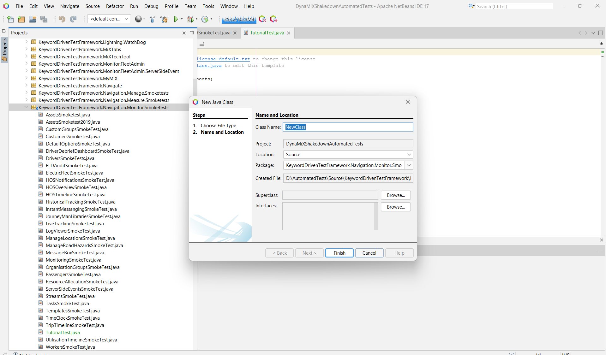
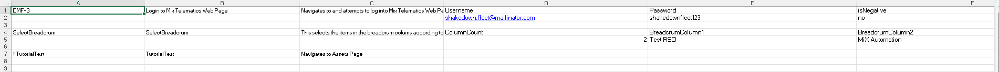

# Selenium: Crafting Your First Test Within the Framework

**Author:** Rofhiwa 'Ralph' Matumba

Ready to write your first test using our Selenium Java framework? This guide will walk you through the specific steps involved using the NetBeans IDE. Our framework has a particular structure to keep tests organized and maintainable. There are a few pieces involved, but we'll cover each one clearly.

## Understanding the Codebase Structure

To successfully add and run a new web test in this framework, four key components need to be correctly set up:

1. **Test Source File (`.java`):** This Java file contains the actual test steps and logic (e.g., clicking buttons, verifying text) using Selenium WebDriver commands.
2. **`TestMarshall` Registration:** The central `TestMarshall.java` file acts as a dispatcher. Your new test needs to be registered within its `switch` statement so the framework knows how to execute it based on its name read from the data file.
3. **Test Pack File (`.java`):** This separate Java file (often ending in `TestPack.java`) sets up the execution context for your test, like specifying which environment and browser to run against, and which data file to use. It uses the JUnit testing framework for structure.
4. **Excel Spreadsheet File (`.xlsx`):** This file, located in the `TestPacks` directory, contains the test data and execution rules, including the test name that links everything together.

Let's go through creating each of these pieces.

## 1. Developing the Test Source File (`TutorialTest.java`)

First, we write the code that performs the actual test actions using Selenium.

1. **Open the Project:** Launch NetBeans and ensure the `AutomatedTests` repository project is open.
2. **Determine Location:** For this example, we'll create a simple "smoke test" (a basic check) for navigating the "Monitor" menu. The framework organizes tests by application area and type. Based on this, the correct location is within the `KeywordDrivenTestFramework.Navigation.Monitor.Smoketests` package.
3. **Navigate in Projects View:** Use the NetBeans "Projects" panel (usually on the left) to navigate to: `AutomatedTests` -> `Source Packages` -> `KeywordDrivenTestFramework.Navigation.Monitor.Smoketests`.
4. **Create New Java Class:** Right-click on the `Smoketests` package node, select `New` > `Java Class...`.
5. **Name the Class:** In the "Class Name" field, enter `TutorialTest`. Leave other settings as default and click "Finish".

     *(Shows the NetBeans dialog for creating a new Java class)*

6. **Add Code Template:** An empty class file `TutorialTest.java` will open. Replace its entire content with the following Java code. This provides a basic structure for a test within our framework:

```java
 /*
  * Test class for demonstrating Monitor -> Assets navigation.
  */
 package KeywordDrivenTestFramework.Navigation.Monitor.Smoketests; // Package declaration matches folder structure

 // Necessary imports from the framework and Java libraries
 import KeywordDrivenTestFramework.Core.BaseClass;
 import static KeywordDrivenTestFramework.Core.BaseClass.SeleniumDriverInstance; // Access Selenium commands
 import static KeywordDrivenTestFramework.Core.BaseClass.narrator; // Access logging/reporting utility
 import KeywordDrivenTestFramework.Entities.Enums;
 import KeywordDrivenTestFramework.Entities.TestEntity;
 import KeywordDrivenTestFramework.Entities.TestResult;
 import java.awt.AWTException;
 import java.io.FileNotFoundException;

 // Test class must extend BaseClass provided by the framework
 public class TutorialTest extends BaseClass {
     String errorMessage = ""; // Stores error messages for reporting
     int counter = 1;        // Step counter for screenshots/logging
     TestEntity testData;    // Holds data passed from the Excel file

     // Constructor - receives test data when the test is instantiated
     public TutorialTest(TestEntity testData) {
         this.testData = testData;
     }

     // The main method where test steps are executed sequentially
     public TestResult executeTest() throws FileNotFoundException, InterruptedException, AWTException {
         // Start timer for measuring test duration
         this.setStartTime();

         // Execute step 1: Click Monitor Tab
         if (!ClickMonitorTab()) {
             // If ClickMonitorTab returns false (meaning it failed)
             // Take a failure screenshot
             SeleniumDriverInstance.takeScreenShot(counter + " - Failed to click Monitor tab", true);
             counter++; // Increment step counter
             // Log failure message
             narrator.failedMessage("Click Monitor - " + errorMessage);
             // Return a FAIL result immediately
             return new TestResult(testData, Enums.ResultStatus.FAIL, "Failed to Click Monitor", this.getTotalExecutionTime());
         }

         // Execute step 2: Click Asset Tab (only runs if step 1 passed)
         if (!ClickAssetTab()) {
             // If ClickAssetTab returns false
             SeleniumDriverInstance.takeScreenShot(counter + " - Failed to click Assets tab", true);
             counter++;
             narrator.failedMessage("Navigation to Assets tab - " + errorMessage);
             // Return a FAIL result
             return new TestResult(testData, Enums.ResultStatus.FAIL, "Failed to Click Assets tab", this.getTotalExecutionTime());
         }

         // If all steps above passed, return a PASS result
         return new TestResult(testData, Enums.ResultStatus.PASS, "Successfully Navigated to Assets Page", this.getTotalExecutionTime());
     }

     /**
      * Helper method for Step 1: Clicks the Monitor tab.
      * Contains the specific Selenium action and error handling.
      * @return True if successful, False otherwise.
      */
     public boolean ClickMonitorTab() {
         // Use SeleniumDriverInstance provided by BaseClass to interact with browser
         if (!SeleniumDriverInstance.clickElementByXpath("(//A[@href='#'])[1]")) {
             // If click fails, set error message and return false
             errorMessage = "Failed to click Monitor Tab using XPath: (//A[@href='#'])[1]";
             return false;
         }
         // If click succeeds, take success screenshot and return true
         SeleniumDriverInstance.takeScreenShot(counter + " - Clicked Monitor Tab", false);
         counter++;
         return true;
     }

     /**
      * Helper method for Step 2: Clicks the Assets sub-menu item.
      * @return True if successful, False otherwise.
      */
     public boolean ClickAssetTab() {
         if (!SeleniumDriverInstance.clickElementByXpath("//a[contains(text(),'Assets')]")) {
             errorMessage = "Failed to click Asset Tab using XPath: //a[contains(text(),'Assets')]";
             return false;
         }

         // Note: Fixed pauses like pause(5000) are generally discouraged.
         // Prefer using explicit waits (e.g., waitForElementVisible) for reliability.
         // Included here to match the original example's structure.
         pause(5000); // Wait 5 seconds

         SeleniumDriverInstance.takeScreenShot(counter + " - Clicked Asset Tab", false);
         counter++;
         return true;
     }
 }
```

* **Understanding the Template:** This Java code defines a class `TutorialTest` extending `BaseClass`. The main logic is in `executeTest()`, which calls helper methods (`ClickMonitorTab`, `ClickAssetTab`) for each step. It uses `SeleniumDriverInstance` for browser actions (like clicking elements by XPath), `narrator` for logging, takes screenshots, and returns a `TestResult`. Using helper methods makes `executeTest` easier to read.
* **Adaptation:** Modify the helper methods (or add new ones) and the calls within `executeTest` to interact with different elements and perform different actions. Replace the example XPaths with appropriate locators for your target elements. Consider replacing `pause()` with explicit waits provided by the framework (if available) or Selenium WebDriver.

## 2. Creating the Test Pack File (`TutorialTestTestPack.java`)

Next, create the "Test Pack" file using the JUnit framework to define test runs.

1. **Navigate:** In the NetBeans Projects view, navigate to the `Test Packages` -> `TestSuites` package (this is typically located under a separate "Test Packages" source root in Maven/NetBeans projects).
2. **Create New Java Class:** Right-click on the `TestSuites` package, select `New` > `Java Class...`, and name it `TutorialTestTestPack`. Click "Finish".
3. **Add Code Template:** Replace the initial content with the following code:

```java
 /*
  * Test Pack file for executing TutorialTest.
  */
 package TestSuites; // Package declaration

 // Imports from framework and JUnit
 import KeywordDrivenTestFramework.Entities.Enums;
 import KeywordDrivenTestFramework.Testing.TestMarshall;
 import KeywordDrivenTestFramework.Utilities.ApplicationConfig;
 import java.io.FileNotFoundException;
 import org.junit.Test; // JUnit annotation for test methods

 /**
  * Test Pack class using JUnit.
  * Each @Test method represents a separate test execution run.
  */
 public class TutorialTestTestPack {
     static TestMarshall instance; // Instance of the framework's test runner

     // Constructor: Sets the default environment for tests in this pack
     public TutorialTestTestPack() {
         ApplicationConfig appConfig = new ApplicationConfig(); // Potentially loads config
         // Define application environment for this test pack run
         TestMarshall.currentEnvironment = Enums.Environment.INT;
     }

     // Test method specifically for running on Internet Explorer (if configured)
     @Test
     public void RunTutorialTestTestPackIE() throws FileNotFoundException {
         System.out.println("Executing Tutorial Test Pack on IE"); // Console output
         // Create TestMarshall instance: specify Excel file and Browser
         instance = new TestMarshall("TestPacks\\TutorialTestTestPack.xlsx", Enums.BrowserType.IE);
         // Run the tests defined in the Excel file
         instance.runKeywordDrivenTests();
     }

     // Test method specifically for running on Chrome
     @Test
     public void RunTutorialTestTestPackChrome() throws FileNotFoundException {
         System.out.println("Executing Tutorial Test Pack on Chrome");
         instance = new TestMarshall("TestPacks\\TutorialTestTestPack.xlsx", Enums.BrowserType.Chrome);
         instance.runKeywordDrivenTests();
     }

     // Test method specifically for running on Firefox
     @Test
     public void RunTutorialTestTestPackFireFox() throws FileNotFoundException {
         System.out.println("Executing Tutorial Test Pack on FireFox");
         instance = new TestMarshall("TestPacks\\TutorialTestTestPack.xlsx", Enums.BrowserType.FireFox);
         instance.runKeywordDrivenTests();
     }
 }
```

* **Understanding the Template:** This file uses JUnit's `@Test` annotation to define runnable test methods. Each method (`RunTutorialTestTestPackChrome`, etc.) typically represents a run configuration for a specific browser. It creates an instance of `TestMarshall`, passing the name of the Excel data file (`TutorialTestTestPack.xlsx`) and the desired browser type. `TestMarshall` then handles reading the Excel file and executing the corresponding test logic classes. The environment (`INT`) is set in the constructor for all tests in this file.

## 3. Setting Up the Excel Spreadsheet File (`TutorialTestTestPack.xlsx`)

The framework uses Excel files to define which tests to run and with what data.

1. **Navigate:** Using Windows Explorer (not NetBeans), go into your cloned repository folder (`AutomatedTests`) and find the `TestPacks` directory.
2. **Copy Existing File:** Find any existing `.xlsx` file in this folder (e.g., `LoginTestPack.xlsx`) and make a copy of it. Copying an existing file is recommended to preserve formatting and required sheets/columns.
3. **Rename:** Rename the copied file to match the name used in the Test Pack code: `TutorialTestTestPack.xlsx`.
4. **Edit Contents:** Open the renamed Excel file. You need to modify the rows and columns to define your test run. Ensure it has the required columns and includes a row for your test (the structure is similar across frameworks):

     *(Shows the required columns and an example row)*

5. **Save:** Save the changes to the Excel file.

### Explanation of Key Columns

* `TestName`: **Crucial.** This must exactly match the `case` name you will add to `TestMarshall.java` (e.g., `TutorialTest`). It links the spreadsheet row to the test code class.
* `TestDescription`: A brief description of the test, often used in test reports.
* `Username`: The email address for the standard MiX Automation user used for login within the tests.
* `Password`: The password for the standard MiX Automation user.
* `Organisation`: The organization context for the test. This **must** be set to `Test RSO`.
* `Site`: The specific site/division within the organization. This **must** be set to `MiX Automation`.

## 4. Updating the `TestMarshall` File

The final step is to register your new test class within the framework's central dispatcher (`TestMarshall.java`).

1. **Navigate:** In NetBeans, go to the `Source Packages` -> `KeywordDrivenTestFramework.Testing` package and open the `TestMarshall.java` file.
2. **Find the `switch` Statement:** Scroll down within `TestMarshall.java` to find a large `switch (testData.TestName)` statement. As of April 15, 2025, the end of this switch is around **line 4114**.
3. **Add New `case`:** Add the following `case` block just *before* the `default:` case at the end of the `switch` statement. Ensure the case label (`"TutorialTest"`) exactly matches the `TestName` in your Excel file.

```java
// Add this block before the default case
case "TutorialTest": { // Matches TestName from Excel
   // Create an instance of your test source class, passing test data
   TutorialTest tut = new TutorialTest(testData);
   // Execute the test logic and add the result to the report generator
   reportGenerator.addResult(tut.executeTest());
   // Increment test counter
   numberOfTest++;
   break; // Exit this case
}
```

* **Function:** This code block tells `TestMarshall`: "When you read 'TutorialTest' from the Excel file, create an instance of the `TutorialTest` class (from `TutorialTest.java`), run its `executeTest` method, and add the returned result to the report."

## Pre-Testing Checklist

Before running, quickly confirm:

* [ ] Test source code (`TutorialTest.java`) created in the correct package.
* [ ] Test pack file (`TutorialTestTestPack.java`) created in the correct package (`TestSuites`).
* [ ] Excel file (`TutorialTestTestPack.xlsx`) created and configured correctly in `TestPacks`.
* [ ] `TestMarshall.java` updated with the new `case "TutorialTest":`.

Good luck with your testing!
